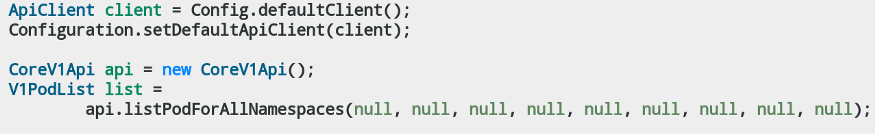
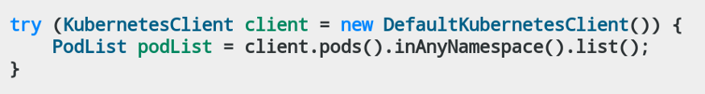
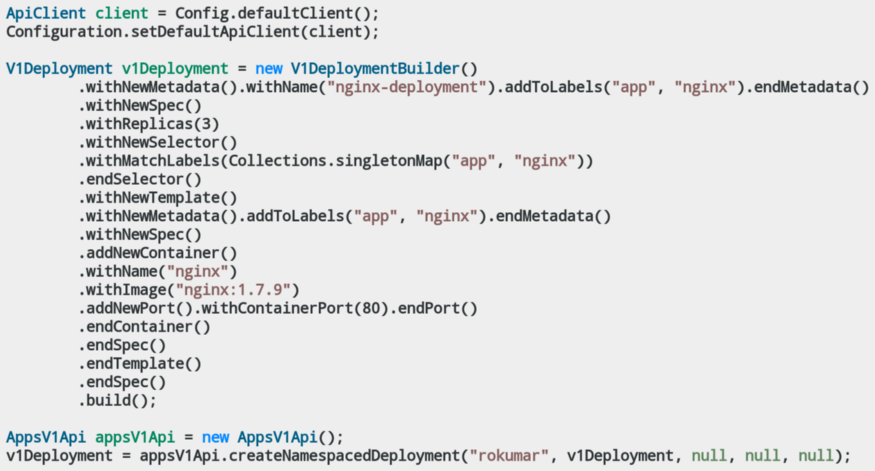
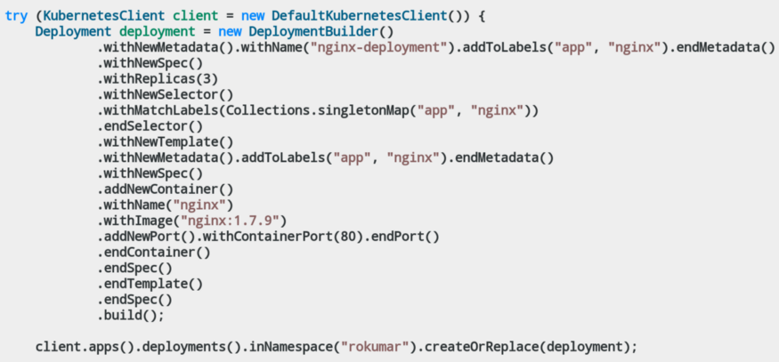
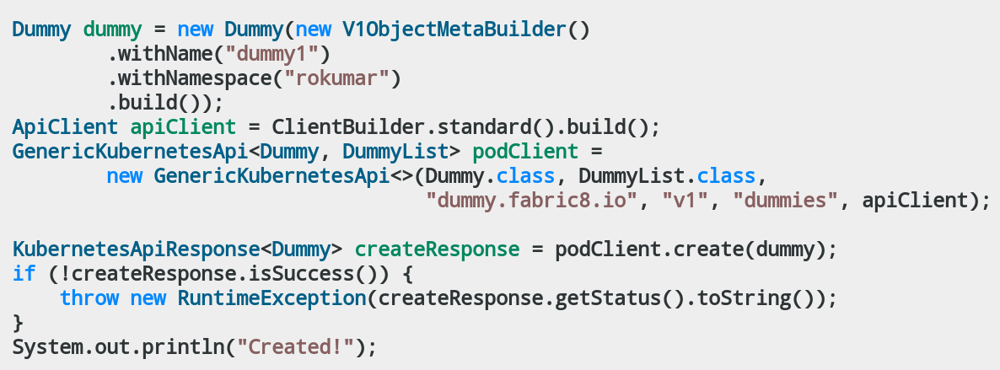
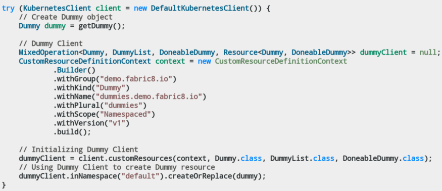
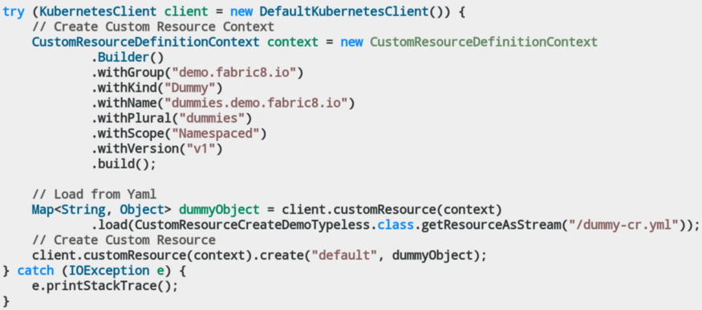

# Fabric8 和官方 Kubernetes Java 客户端的区别
## 1. 历史
Fabric8 Kubernetes 客户端由[Ioannis Cannelos](https://github.com/iocanel) 和 [Jimmy Dyson](https://github.com/jimmidyson)在 Kubernetes 早期的2015年发起用作一个与 Kubernetes 交互的Java框架。在那个时候，Fabric8 项目期待成为一个运行在 Kubernetes 上的云原生微服务的 PaaS 平台。Fabric8 Kubernete 客户端库在 Fabric8 生态中扮演的关键角色，因为它通过 Kubernetes REST API 提供了一个抽象。

官方 Kubernetes Java 客户端由 [Brendan Burns](https://github.com/brendandburns)（他也是 Kubernetes 的创建者）在 2017 年开创，同时还有免想起他几个语言的库，如 PERL, Javascript, Python 等。所有的客户端看起来都是从一个 [OpenAPI generator](https://github.com/OpenAPITools/openapi-generator)脚本生成：[kubernetes-client/gen](https://github.com/kubernetes-client/gen)，Java客户端以同样的方式生成。因此它的使用方式与其它客户端很像，毕竟它们由同一个脚本生成。
## 2. 官方和 Fabric8 Java 客户端提供的包


## 3. 用户数量
当我查看使用两个库的用户数量时，Fabric8 远远走在前头。我汇聚了所有报的使用统计，以下是基于 Github insights 的 Github 上的依赖数：
- Fabric8 Kubernetes 客户端（所有包）：8152 Github 仓库
- 官方 Kubernetes 客户端（所有包）：672 Github 仓库
## 4. 使用差异
现在让我们看看两种客户端用法上的差异。我们将查看用户使用 Kubernetes 客户端与 Kubernetes API 交互的公共用例。
### 列出名字空间里的所有 Pods( kubectl get pods ):
下面是列出一个特定名字空间里的所有 Pod 的例子，基本上与 `kubectl get pods` 命令等同。

[官方 Kubernetes 客户端](https://github.com/rohanKanojia/fabric8-official-java-client-comparison/blob/master/src/main/java/io/kubernetes/TestingPodList.java)：



[Fabric8 Kubernetes 客户端](https://github.com/rohanKanojia/fabric8-official-java-client-comparison/blob/master/src/main/java/io/fabric8/PodListTest.java)：


### 创建特定服务（kubectl create -f service.yml）
让我们看看一个例子，我们已经有了一个 Yaml 清单文件，我们将它作为一个 Java POJO（kubernetes Java model）加载，并应用于 Kubernetes 服务器。

[官方 Kubernetes 客户端](https://github.com/rohanKanojia/fabric8-official-java-client-comparison/blob/master/src/main/java/io/kubernetes/LoadAndCreateService.java)：
```
ApiClient client = Config.defaultClient();
Configuration.setDefaultApiClient(client);

File file = new File(LoadAndCreateService.class.getResource("/test-svc.yaml").getPath());
V1Service yamlSvc = (V1Service) Yaml.load(file);

CoreV1Api api = new CoreV1Api();
V1Service createResult = api.createNamespacedService("rokumar", yamlSvc, null, null, null);
```
[Fabric8 Kubernetes 客户端](https://github.com/rohanKanojia/fabric8-official-java-client-comparison/blob/master/src/main/java/io/fabric8/LoadAndCreateService.java)：
```
try (KubernetesClient client = new DefaultKubernetesClient()) {
    Service svc = client.services()
            .load(LoadAndCreateService.class.getResourceAsStream("/test-svc.yaml"))
            .get();

    client.services().inNamespace("rokumar").createOrReplace(svc);
}
```
### 监视 Pod（kubectl get pods -w）
因为监视涉及到简单 HTTP 调用，使用官方客户端监视 Pod 稍有不同。另一方面，Fabric8 Kubernetes 客户端使用 Web-sockets 监视资源。

[官方 Kubernetes 客户端](https://github.com/rohanKanojia/fabric8-official-java-client-comparison/blob/master/src/main/java/io/kubernetes/WatchPods.java)：
```
ApiClient client = Config.defaultClient();
Configuration.setDefaultApiClient(client);
CoreV1Api api = new CoreV1Api();
Watch<V1Pod> watch =
        Watch.createWatch(
                client,
                api.listNamespacedPodCall("rokumar", null, null, null, null, null, 5, null, null, 5, Boolean.TRUE, null),
                new TypeToken<Watch.Response<V1Pod>>() {}.getType());
try {
    for (Watch.Response<V1Pod> item : watch) {
        System.out.printf("%s : %s%n", item.type, item.object.getMetadata().getName());
    }
} finally {
    watch.close();
}
```
[Fabric8 Kubernetes 客户端](https://github.com/rohanKanojia/fabric8-official-java-client-comparison/blob/master/src/main/java/io/fabric8/PodWatchTest.java)：
```
try (KubernetesClient client = new DefaultKubernetesClient()) {
    Watch watch = client.pods().inNamespace("default").watch(new Watcher<Pod>() {
        @Override
        public void eventReceived(Action action, Pod pod) {
            System.out.printf("%s : %s%n", action.name(), pod.getMetadata().getName());
        }

        @Override
        public void onClose(WatcherException e) {
            System.out.printf("onClose : %s\n", e.getMessage());
        }

    });

    // Watch till 10 seconds
    Thread.sleep(10 * 1000);

    // Close Watch
    watch.close();
} catch (InterruptedException e) {
    e.printStackTrace();
}
```
### 使用构建器创建部署（kubectl create deploy）
你能够使用 Fabric8 Kubernetes 客户端构建器快速创建部署，它们基于[sundrio library](https://github.com/sundrio/sundrio)，也被移植进官方 Kubernetes 客户端库。你会注意到这些构建器在动态创建 Kubernetes 资源时很有用。

[官方 Kubernetes 客户端](https://github.com/rohanKanojia/fabric8-official-java-client-comparison/blob/master/src/main/java/io/kubernetes/DeploymentDemo.java)：



[Fabric8 Kubernetes 客户端](https://github.com/rohanKanojia/fabric8-official-java-client-comparison/blob/master/src/main/java/io/fabric8/SimpleDeploymentCreate.java)：


### 创建自定义资源
当撰写 Kubernetes operators 时会被用刀，因此控制自定义资源是一项很重要的特性。Fabric8 和官方客户端都有自己的支持自定义资源的方式。

官方 Kubernetes 客户端并没有在主要的 `client-java` jar中提供 Kubernetes 自定义资源的支持。为了能够使用 `CustomResources` 你必须添加额外的依赖。

然而，Fabric8 Kubernetes 客户端库却不需要任何额外的依赖。下面是利用 Fabric8 和官方客户端控制名为 `Dummy` 的 `CustomResources` 的简单例子。

[官方 Kubernetes 客户端](https://github.com/rohanKanojia/fabric8-official-java-client-comparison/blob/master/src/main/java/io/kubernetes/CustomResourceDemo.java)：

为了能够在官方 Kubernetes 客户端中使用 CustomResources，你需要在你的代码中天津爱额外的依赖：
```
<dependency>
   <groupId>io.kubernetes</groupId>
   <artifactId>client-java-extended</artifactId>
   <version>${client-java.version}</version>
</dependency>
```
一旦这个依赖被安装，你就可以使用 `GenericKubernetesApi`，它是一个带两个参数的泛型类：资源类型和资源列表类型。你需要为你的自定义资源提供 POJOs。下面是一个如何使用它的例子：



Fabric8 Kubernetes 客户端：

由于他的支持集成进了 Fabric8 API。你不需要任何额外的依赖即可使用 `CustomResources`。利用 Fabric8 Kubernetes 客户端你可以有两种方式使用`CustomResources`。
- [Typed API](https://github.com/fabric8io/kubernetes-client/blob/master/doc/CHEATSHEET.md#customresource-typed-api) (required POJOs)
- [Typeless API](https://github.com/fabric8io/kubernetes-client/blob/master/doc/CHEATSHEET.md#customresource-typeless-api) (doesn’t require any POJOs)




## 5. 官方 Kubernetes 客户端独有特性
+ 能够通过不同的 apiVersions 提供对 Kubernetes 资源的支持。这在 Fabric8 中也开始支持，那被废所有的资源。但官方客户端为一个Deployment资源产生不同的类 [AppsV1Beta1Deployment](https://github.com/kubernetes-client/java/blob/master/kubernetes/src/main/java/io/kubernetes/client/models/AppsV1beta1Deployment.java), [V1Beta2Deployment](https://github.com/kubernetes-client/java/blob/master/kubernetes/src/main/java/io/kubernetes/client/models/V1beta2Deployment.java), 和 [V1Deployment](https://github.com/kubernetes-client/java/blob/master/kubernetes/src/main/java/io/kubernetes/client/models/V1Deployment.java)。
+ 支持 Azure 认证
+ 使用 Swagger 模式用于 Kubernetes 资源的生成
+ 不同 API 组有不同的入口。例如，使用 `ore/v1` 的包会使用 [CoreV1Api](https://github.com/kubernetes-client/java/blob/master/kubernetes/src/main/java/io/kubernetes/client/openapi/apis/CoreV1Api.java)，在 `apps/v1` 包里的所有资源使用 [AppsV1Api](https://github.com/kubernetes-client/java/blob/master/kubernetes/src/main/java/io/kubernetes/client/openapi/apis/AppsV1Api.java)
## 6. Fabric8  Kubernetes 客户端独有特性
+ 与 Kubernetes API 交互的丰富的 DSL（Domain Specific Language）。例如你可以赢一行代码 `client.pods().inAnyNamespace().list()` 实现一个简单的 `kubectl` 操作如 `kubectl get pods`。
+ 监控连接管理：Fabric8 Kubernetes 客户端使用 WebSockets，其底层支持监视和重连特性，这提供了监视 Kubernetes 资源的可靠的支持。
+ 等待直至条件支持集成进 DSL
+ 有许多用户工具来实现一些 Kubernetes 资源的简单任务
+ 通过系统属性，环境变量，~/.kube/config，ServiceAccount 令牌以及挂在的 CA 证书来实现集群连接配置。基本上，那意味着当从你的系统或从一个Pod内部使用客户端时你不需要做任何种类的配置。
+ 对 CustomResources 的原始支持，不需要提供任何类型或POJO。
+ 支持 Deployment 回滚：restart() , undo(), updateImage() 等都已经被集成进 DSL。
+ 支持客户端认证命令如 aws-iam-authenticator
+ 支持 OAuthToken 认证
+ 使用 Kubernetes Sources直接生成 Kuberneted 模板代码
+ 为了满足你的需求客户可以基于 KubernetesClient 实现扩展钩子。现在 Fabric8 Kubernetes 客户端已经有如下扩展：[Knative](https://github.com/fabric8io/kubernetes-client/tree/master/extensions/knative), [Tekton](https://github.com/fabric8io/kubernetes-client/tree/master/extensions/tekton), [Istio](https://github.com/snowdrop/istio-java-api), [ServiceCatalog](https://github.com/fabric8io/kubernetes-client/tree/master/extensions/service-catalog) 和 [Kudo(当前处于WIP状态)](https://github.com/fabric8io/kubernetes-client/pull/2197)

## 7. 结论
到了这里我应该结束这篇博文，但等等，我还没有回答一个问题，“那个客户端是根号使用的那个？”。我使用 Fabric8 工作过，因此我通常会建议使用Fabric8，因为我认为他在提供 Java 开发体验上更好。因此，我把这留给用户，你可以根据自己的需求选择合适的那个。

你可以在 [Github仓库里](https://github.com/rohanKanojia/fabric8-official-java-client-comparison) 找到本博问礼的所有源代码。

我希望这篇博文能够帮助你找到适合你的需求的客户端，谢谢！

## Reference
- [Fabric8 和官方 Kubernetes Java 客户端的区别](https://itnext.io/difference-between-fabric8-and-official-kubernetes-java-client-3e0a994fd4af?gi=2835455667bd)
- [Client Libraries](https://kubernetes.io/docs/reference/using-api/client-libraries/)

